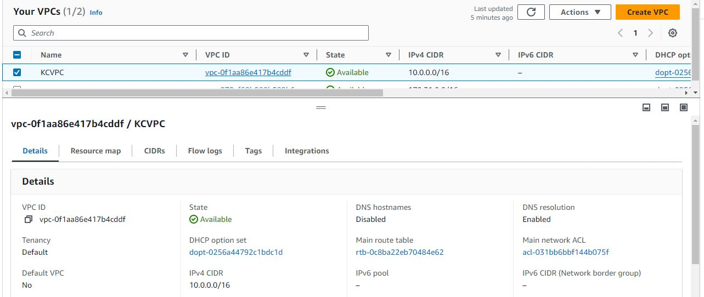
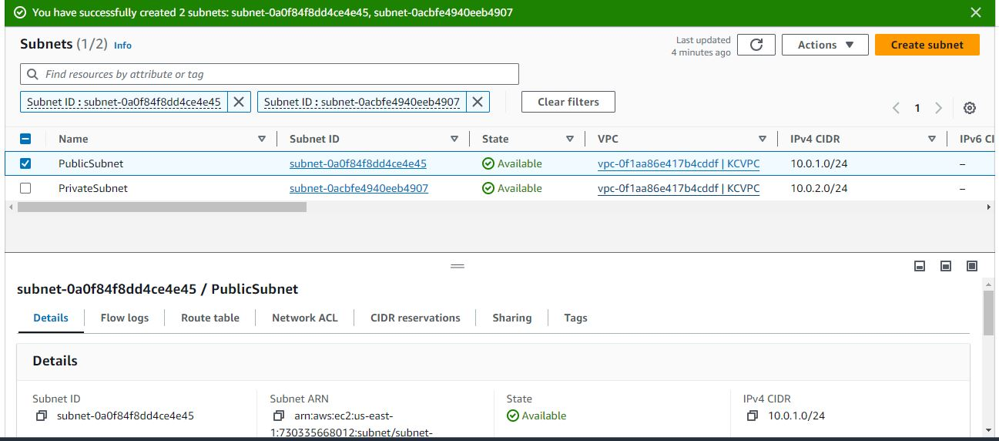
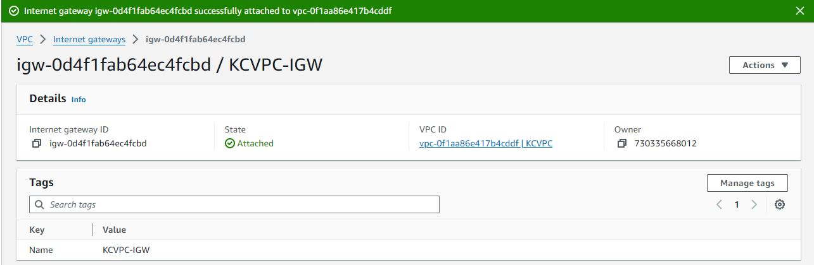
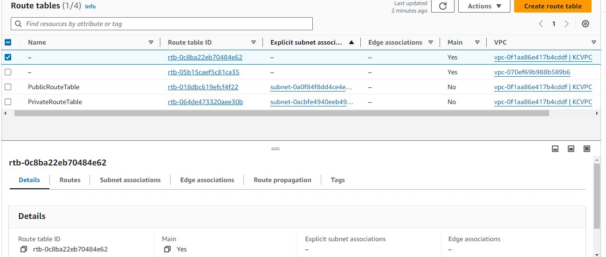
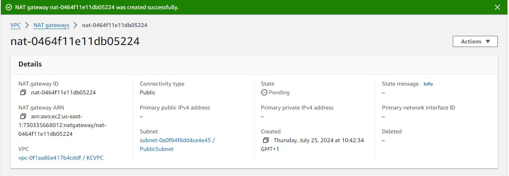
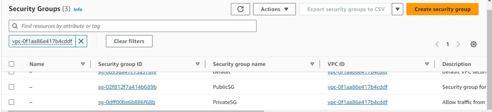
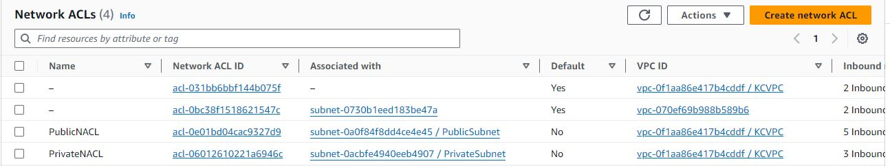
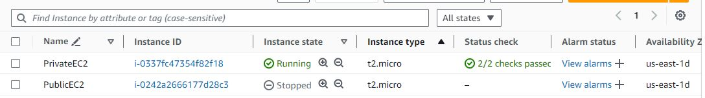
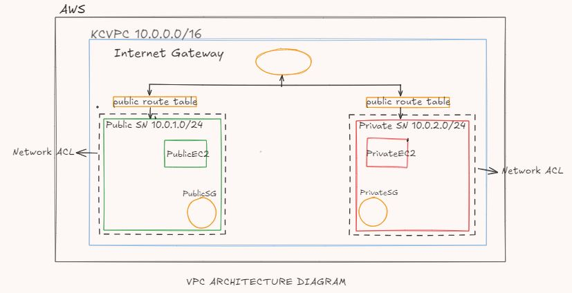

# AWS VPC Setup with Public and Private Subnets

This README documents the process of setting up a Virtual Private Cloud (VPC) in AWS with both public and private subnets. The setup includes routing, security groups, and network access control lists (NACLs) to ensure proper communication and security within the VPC.

## Table of Contents
- [AWS VPC Setup with Public and Private Subnets](#aws-vpc-setup-with-public-and-private-subnets)
  - [Table of Contents](#table-of-contents)
  - [1. VPC Creation](#1-vpc-creation)
  - [2. Subnet Creation](#2-subnet-creation)
    - [Public Subnet](#public-subnet)
    - [Private Subnet](#private-subnet)
  - [3. Internet Gateway Configuration](#3-internet-gateway-configuration)
  - [4. Route Table Configuration](#4-route-table-configuration)
    - [Public Route Table](#public-route-table)
    - [Private Route Table](#private-route-table)
  - [5. NAT Gateway Setup](#5-nat-gateway-setup)
  - [6. Security Group Configuration](#6-security-group-configuration)
    - [Public Security Group](#public-security-group)
    - [Private Security Group](#private-security-group)
  - [7. Network ACL Configuration](#7-network-acl-configuration)
    - [Public Subnet NACL](#public-subnet-nacl)
    - [Private Subnet NACL](#private-subnet-nacl)
  - [8. EC2 Instance Deployment](#8-ec2-instance-deployment)
    - [Public EC2 Instance](#public-ec2-instance)
    - [Private EC2 Instance](#private-ec2-instance)
  - [10. Component Explanations](#10-component-explanations)

## 1. VPC Creation

1. Log in to the AWS Management Console and navigate to the VPC dashboard.
2. Click "Create VPC" and enter the following details:
   - Name: KCVPC
   - IPv4 CIDR block: 10.0.0.0/16
3. Click "Create VPC"

## 2. Subnet Creation

### Public Subnet

1. In the VPC dashboard, navigate to "Subnets" and click "Create subnet"
2. Select the KCVPC and enter the following details:
   - Name: PublicSubnet
   - IPv4 CIDR block: 10.0.1.0/24
   - Availability Zone: eu-west-1a (or any available AZ in your region)
3. Click "Create subnet"

### Private Subnet

1. Repeat the process with the following details:
   - Name: PrivateSubnet
   - IPv4 CIDR block: 10.0.2.0/24
   - Availability Zone: eu-west-1a (same as PublicSubnet for simplicity)

## 3. Internet Gateway Configuration

1. In the VPC dashboard, navigate to "Internet Gateways" and click "Create internet gateway"
2. Name it "KCVPC-IGW" and create it
3. Select the newly created IGW and click "Actions" > "Attach to VPC"
4. Select KCVPC and click "Attach"

## 4. Route Table Configuration

### Public Route Table

1. In the VPC dashboard, go to "Route Tables" and click "Create route table"
2. Name it "PublicRouteTable" and associate it with KCVPC
3. Select the new route table and go to the "Routes" tab
4. Click "Edit routes" and add a new route:
   - Destination: 0.0.0.0/0
   - Target: Select the Internet Gateway (KCVPC-IGW)
5. Save the changes
6. Go to the "Subnet associations" tab and associate PublicSubnet with this route table

### Private Route Table

1. Create another route table named "PrivateRouteTable" associated with KCVPC
2. Associate PrivateSubnet with this route table
3. No need to add a route to the internet at this point

## 5. NAT Gateway Setup

1. In the VPC dashboard, go to "NAT Gateways" and click "Create NAT Gateway"
2. Select PublicSubnet as the subnet
3. Click "Allocate Elastic IP" to assign a new Elastic IP to the NAT Gateway
4. Create the NAT Gateway
5. Once created, edit the PrivateRouteTable:
   - Add a new route with destination 0.0.0.0/0 and target as the newly created NAT Gateway

## 6. Security Group Configuration

### Public Security Group

1. In the EC2 dashboard, go to "Security Groups" and click "Create security group"
2. Name: PublicSG
3. Description: Security group for public instances
4. VPC: Select KCVPC
5. Inbound rules:
   - Allow HTTP (port 80) from anywhere (0.0.0.0/0)
   - Allow HTTPS (port 443) from anywhere (0.0.0.0/0)
   - Allow SSH (port 22) from your IP (e.g., 203.0.113.0/32)
6. Outbound rules:
   - Allow all traffic to anywhere (0.0.0.0/0)

### Private Security Group

1. Create another security group named "PrivateSG"
2. Inbound rules:
   - Allow MySQL (port 3306) from the PublicSubnet CIDR (10.0.1.0/24)
3. Outbound rules:
   - Allow all traffic to anywhere (0.0.0.0/0)

## 7. Network ACL Configuration

### Public Subnet NACL

1. In the VPC dashboard, go to "Network ACLs" and create a new NACL
2. Name it "PublicNACL" and associate it with KCVPC
3. Associate it with PublicSubnet
4. Add inbound rules:
   - Allow HTTP (port 80) from 0.0.0.0/0
   - Allow HTTPS (port 443) from 0.0.0.0/0
   - Allow SSH (port 22) from your IP
   - Allow ephemeral ports (1024-65535) from 0.0.0.0/0
5. Add outbound rules:
   - Allow all traffic to 0.0.0.0/0

### Private Subnet NACL

1. Create another NACL named "PrivateNACL"
2. Associate it with PrivateSubnet
3. Add inbound rules:
   - Allow traffic from PublicSubnet CIDR (10.0.1.0/24)
   - Allow ephemeral ports (1024-65535) from 0.0.0.0/0
4. Add outbound rules:
   - Allow all traffic to PublicSubnet CIDR (10.0.1.0/24)
   - Allow all traffic to 0.0.0.0/0

## 8. EC2 Instance Deployment

### Public EC2 Instance

1. In the EC2 dashboard, click "Launch Instance"
2. Choose an Amazon Linux 2 AMI
3. Select t2.micro instance type
4. Configure instance details:
   - Network: KCVPC
   - Subnet: PublicSubnet
   - Auto-assign Public IP: Enable
5. Add storage: Use defaults
6. Add tags: Name: PublicEC2
7. Configure security group: Select the existing PublicSG
8. Launch the instance

### Private EC2 Instance

1. Launch another instance with similar settings, but:
   - Subnet: PrivateSubnet
   - Auto-assign Public IP: Disable
   - Security group: PrivateSG
   - Name tag: PrivateEC2

## 10. Component Explanations

1. **VPC (KCVPC)**: Virtual Private Cloud that provides an isolated network environment.

2. **Subnets**: Public and private sub-networks within the VPC

3. **Internet Gateway (IGW)**: Allows communication between instances in the VPC and the internet.

4. **NAT Gateway**: Allows instances in the private subnet to connect to the internet.

5. **Route Tables**: Contains a set of rules (routes) that determine where network traffic is directed.

6. **Security Groups**: Act as a virtual firewall for instances to control inbound and outbound traffic at the instance level.

7. **Network ACL**: Provide an additional layer of security at the subnet level.

